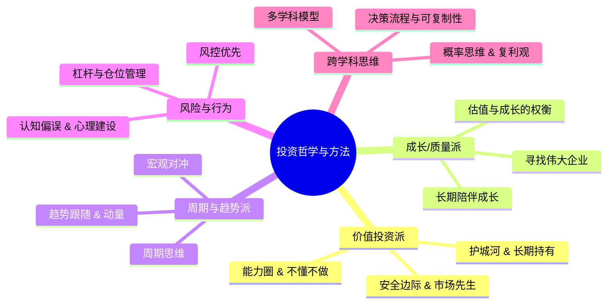

向成功投资者学习方法与哲学的书籍、博客/平台资源推荐

---

先给你一个结论版地图，再展开细说。
**核心思路：**  
“向成功投资者学习”，重点不是抄作业，而是搞清楚三件事：  
1）他们怎么理解世界（哲学）；  
2）他们怎么下注（方法论）；  
3）他们如何控制自己（纪律与风控）。
下面这张思维导图，把你要学的“哲学 + 方法”做一个结构化拆分：

下面分三块：**经典书籍 → 中文实战派 → 英文博客/平台**，并注明各自偏哪一块。
---
## 一、经典书籍：按“流派”来选读
### 1. 价值投资哲学：格雷厄姆 → 巴菲特 → 芒格 → 马克斯
这几本几乎是被反复验证过的“底层操作系统”。
1）**《聪明的投资者》 – 本杰明·格雷厄姆**  
- 核心关键词：安全边际、市场先生、防御型/进取型投资者。  
- 适合你：哪怕只读前几章，也能建立“先不亏大钱，再谈赚钱”的底层思维。
2）**《证券分析》 – 格雷厄姆 & 多德**  
- 更偏“专业教材”，系统讲债券/股票基本面分析。  
- 建议有一定财务基础后再啃，当案头参考书。
3）**《巴菲特致股东的信》**  
- 巴菲特亲笔写几十年投资原则与案例，比传记更“方法论”。  
- 重点看：如何评估“好生意、好管理层、好价格”。
4）**《穷查理宝典》 – 查理·芒格**  
- 不是纯投资技术，而是“多元思维模型 + 逆向思考 + 品格”的系统。  
- 芒格的“在鱼多的地方钓鱼”“反过来想，总是反过来想”是非常典型的哲学。
5）**《投资最重要的事》+《周期》 – 霍华德·马克斯**  
- 前者讲“第二层次思维”、风险定价、预期差；后者讲周期与钟摆。  
- 特别适合理解：**牛市是怎么走过头，熊市是怎么跌过头**，以及你在其中该站在哪一边。
6）**《价值投资：从格雷厄姆到巴菲特（第2版）》 – 格林沃尔德 等**  
- 用现代学术框架系统梳理价值投资，从理论到估值方法。  
- 想把“价值投资”当成一个体系来学，这本书可以作为主线教材。
---
### 2. 成长/质量派：费雪、林奇、国内实践者
1）**《怎样选择成长股》 – 菲利普·费雪**  
- 巴菲特说自己是“85%格雷厄姆 + 15%费雪”。  
- 核心是：如何从“管理层、研发、销售、利润增长”等角度识别长期成长股。
2）**《彼得·林奇的成功投资》**  
- 讲“买你看得懂的公司”，从日常生活发现投资机会。  
- 对普通投资者很友好，强调“在自己的能力圈里做事”。
3）**《时间的玫瑰》 – 但斌**  
- 国内长期持有优质资产的实践者，结合中国案例讲“穿越周期的企业”。  
- 可以看到：**如何在中国语境下实践长期持有伟大企业**。
---
### 3. 周期 / 趋势 / 宏观对冲
1）**《股票作手回忆录》 – 杰西·利弗莫尔传记**  
- 虽是老交易员传记，但关于“人性、贪婪恐惧、趋势与仓位管理”的部分，至今被大量专业投资者反复看。  
- 重点不是具体招式，而是对“人性在趋势中的放大与毁灭”的理解。
2）**关于趋势跟踪/宏观对冲的英文作品（如 AQR/机构报告）**  
- 例如 AQR 的《Trend-Following: Why Now? A Macro Perspective》系统解释趋势跟踪的历史表现与在组合中的作用。  
- Macrosynergy 的研究把“价格趋势 + 宏观指标”结合起来做股票趋势策略。  
- 如果你未来想走“系统化交易/宏观对冲”路线，这类文献比纯技术分析书更扎实。
---
### 4. 风控、行为与认知框架
1）**《思考，快与慢》 – 丹尼尔·卡尼曼**  
- 不是讲股票，而是系统讲人类决策偏误（锚定效应、禀赋效应、过度自信等）。  
- 对理解“自己为什么总追涨杀跌、为什么拿不住好股票”非常有帮助。
2）**《原则》 – 瑞·达利欧**  
- 更多是“如何构建系统化决策流程”，把工作、投资、生活当成一套可迭代的原则系统。  
- 对构建你自己的“投资原则清单”很有启发。
3）**《纳瓦尔宝典》 – 埃里克·乔根森 整理**  
- 讲“财富、杠杆、复利与个人成长”的底层哲学。  
- 对理解“长期主义、资产配置、个人商业模式”有帮助，但不是传统投资教材。
---
## 二、中文世界：高质量实战派与平台
### 1. 综合型社区：雪球（选几个标杆作者）
雪球本身是一个投资社区，里面既有噪音，也有少数长期实战、愿意把“哲学 + 方法”讲清楚的人。你可以把它当成“案例库 + 观点对照”，而不是信息流。
可以重点跟踪几类“实战 + 讲方法论”的作者（只列代表性人物，不构成任何买卖建议）：
1）**唐书房（老唐）**  
- 书籍：《手把手教你读财报》《价值投资实战手册》。  
- 风格：深度基本面、自由现金流估值、只投“看得懂、算得清、睡得着”的公司。  
- 对你：非常典型的“价值投资方法论 + 财表实战”范本。
2）**闲来一坐s话投资**  
- 书籍：《慢慢变富》。  
- 强调：长期持有、消费/医药龙头、用企业成长对抗波动。  
- 对你：适合理解“如何把价值投资体系化成一套可以长期坚持的纪律”。
3）**银行螺丝钉**  
- 书籍：《指数基金投资指南》。  
- 专注：指数基金估值表、定投策略、适合不想研究个股的人。  
- 对你：理解“如何用指数基金做资产配置 + 定投纪律”。
4）**持有封基（金伟民）**  
- 书籍：《十年十倍》《聪明的定投》《寻找鱼多的池塘》。  
- 专注：可转债、封基、分级A等“低风险 + 轮动”策略，用量化思维做散户可复制的策略。  
- 对你：理解“如何在控制回撤的前提下，赚确定的小钱”。
5）**不明真相的群众（方三文）**  
- 书籍：《世风日上》。  
- 内容：更多是资产配置、认知边界、市场规律等“哲学层面”的讨论。  
- 对你：适合提升对“市场本质、资产配置、心态”的理解。
6）**无思无虑无忧**  
- 特点：逆向价值、严守能力圈、强调“睡得着觉”的持仓，同时被百度百科等收录，属于有实战背书的一类。  
- 对你：可以看到“如何把价值投资和逆向思维结合”。
7）**其他有代表性的实战者**  
- 如姜诚（深度低估值价值派）、林园、但斌等，在雪球上也都有长期记录和访谈。  
- 建议你按“风格是否匹配自己风险承受力”来筛选，而不是按名气。
**使用建议：**
- 不要试图把所有人看完，而是：  
  选 2–3 个和你理念相近的作者，系统看他们的长贴 + 回答 + 书籍，重点是**他们如何做决策、如何定义风险**，而不是具体持仓。
---
### 2. 中文书籍：系统学习价值投资 & 实战
1）**《价值》 – 张磊（高瓴资本）**  
- 核心哲学：守正用奇、弱水三千但取一瓢、桃李不言下自成蹊。  
- 强调：长期主义、赋能式投资、在中国语境下寻找伟大企业。
2）**《在苍茫中传灯》 – 姚斌**  
- 系统梳理价值投资的内涵、策略、估值、组合构建和“投资修行”。  
- 对你：可以作为“中文世界价值投资总纲式”读物。
3）**《制胜投资》 – 戚克栴**  
- 用中西方资本市场实战经验，构建“中国化”的价值投资体系与估值模型。  
- 对你：理解“如何把价值投资落地到中国制度和市场环境”。
4）**《慢慢变富》《看透银行》等雪球系书籍**  
- 前者讲长期主义与散户心态；后者专注银行股投资，把行业逻辑、财报、估值讲得很透。  
- 对你：看到“如何在一个行业内深耕，建立自己的能力圈”。
5）**《价值投资大行其道，10本书助你从入门到精通》**  
- 这篇整理了从《聪明的投资者》到《投资最重要的事》等 10 本经典，可以作为“扩展书单”。
---
### 3. 中文网站 / 工具型平台（偏数据和资讯）
这些不是“哲学书”，但能帮你把基本面与数据吃透：
1）**Value500 投资导航**  
- 一个长期运营的价值投资导航站，整合了：  
  - 财报数据、估值指标（PE/PB）、行业市盈率；  
  - 各类数据源（宏观、行业、基金持仓、可转债等）。  
- 对你：相当于“价值投资数据总入口”，方便你做“自下而上”的基本面研究。
2）**集思录**  
- 专注低风险品种：可转债、分级A、封基、套利机会等。  
- 对你：理解“如何在控制风险的前提下，做收益风险比更高的策略”。
3）**巨潮资讯网、问财、萝卜投研、慧博等**  
- 用来查公告、研报、财务数据、筛选条件股。  
- 属于“工具层”，配合方法论一起用。
---
## 三、英文博客 / 平台：偏哲学与方法论
### 1. 哲学 + 宏观 + 资产配置
1）**Philosophical Economics（philosophicaleconomics.com）**  
- 内容：宏观、行为金融、资产配置、指数投资、博弈论等。  
- 特点：文章非常长，逻辑链条清晰，属于“真正在思考投资本质”的那类写作者。  
- 对你：适合理解“长期回报从哪来、被动投资对市场的影响、资产配置背后的逻辑”。
2）**Aleph Blog（alephblog.com）**  
- 作者有很强的资产配置与保险背景，强调“简单、长期、低换手”。  
- 文章如“为什么简单投资方法往往更有效”等，非常适合修正“复杂策略才有优势”的误区。
### 2. 趋势跟踪 / 系统化交易（方法论很清晰）
1）**AQR 的趋势跟踪研究（如《Trend-Following: Why Now? A Macro Perspective》）**  
- 内容：系统解释趋势跟踪策略的历史表现、与股债的相关性、在组合中的角色。  
- 对你：理解“为什么趋势跟踪能在长期降低组合回撤、提高风险调整后收益”。
2）**Graham Capital、Standpoint Funds 等机构的趋势跟踪文章**  
- 重点讲：系统化交易规则、如何跟随中长期趋势、如何避免情绪干扰。  
- 对你：如果想往“系统化趋势/宏观交易”走，这些内容比民间技术分析要扎实得多。
3）**Macrosynergy 的研究**  
- 把“价格趋势 + 宏观指标”结合，做股票指数的趋势策略。  
- 对你：理解“趋势信号 + 宏观过滤”的现代做法。
### 3. 价值投资 + 长期思维
英文博客极多，建议你先用少数几个口碑好、偏“教育 + 长期思维”的入口，比如：
- **Wealthtender 评选的五星级投资博客**：如 Just Start Investing、Invested Wallet、Dividend Power 等。  
  - 它们多数偏长期投资、分红、资产配置和心态管理，而不是短线炒作。
---
## 四、怎么“用好”这些资源：一个可落地的学习路径
你已经有经济学基础，建议这样安排：
1. **先用书构建“哲学框架”（按顺序）：**  
   - 《聪明的投资者》 → 《投资最重要的事》/《周期》 → 《穷查理宝典》 → 《原则》/《纳瓦尔宝典》。  
   - 目标：搞清楚“自己是谁、风险承受能力如何、想赚哪一类钱”。
2. **再选一条“主线方法”深入：**  
   - 价值派：在 A 股选一个你看得懂的行业（消费/医药/金融），结合老唐、闲来一坐s话投资等人的书和长文，做 2–3 个公司的深度案例。  
   - 指数/配置派：跟着银行螺丝钉的估值表，做一段时间的指数基金定投与资产配置练习。  
   - 低风险/轮动派：在集思录上学习可转债、封基等品种，理解“风险收益不对称”的策略。
3. **用“哲学类博客”提升认知，而不是抄观点：**  
   - 每周读 1 篇 Philosophical Economics 或 Aleph 的长文，重点不是结论，而是“他是如何拆问题、如何用逻辑和证据得出结论”的。
4. **建立自己的“投资原则清单”：**  
   - 从这些书和实战者中提炼出 10–20 条你自己的原则，比如：  
     - 不懂不做，只投自己理解的行业；  
     - 单一标的不超过总仓位的 X%；  
     - 任何买入前先问“最坏情形是什么”，再想“预期收益是否对得起这个风险”；  
     - 任何重大决策前，写清逻辑和假设，并记录时间戳，以便事后复盘。
---
如果你愿意，我可以根据：  
- 你更偏向“长期持有好公司”，还是“趋势/轮动/宏观”，  
- 你能接受的研究深度（看财报 vs 看指数），  
帮你再细化一个“12 个月书单 + 每月学习重点 + 可实操的练习清单”，让你能把这些资源真正变成自己的体系。

---
---

非常棒！在掌握了理论框架和实践工具后，直接向那些在市场中长期取得卓越成就的大师学习，是提升投资境界最快的途径。这相当于在“隧道对挖”的过程中，请来最顶级的工程师为你指点迷津。

成功的投资者，其价值不仅在于他们赚了多少钱，更在于他们形成了一套**逻辑自洽、可重复、且穿越牛熊的哲学思想和决策系统**。以下为您梳理的，正是这些思想的精华所在。

---

### **第一梯队：思想的源头 (The Source Code)**

这些人不仅是成功的投资者，更是开创流派的一代宗师。他们的原著是所有后续思想的基石，必须反复精读。

#### **1. 本杰明·格雷厄姆 (Benjamin Graham) - 价值投资之父**

*   **核心哲学：** 股票是企业所有权的一部分，而非交易代码。通过严谨的财务分析，以远低于其内在价值的价格（即**“安全边际”**）买入，并利用**“市场先生”**的非理性情绪获利。
*   **必读著作：**
    *   **《聪明的投资者》(The Intelligent Investor):** 这是写给普通投资者的“圣经”。它构建了价值投资的整个精神框架。**巴菲特称其为“有史以来最好的投资书籍”**。重点理解“投资与投机的区别”、“市场先生”的比喻和“安全边际”的重要性。
    *   **《证券分析》(Security Analysis):** 这是写给专业人士的“教科书”，更为艰深和量化。如果你想深入骨髓地学习如何对公司进行地毯式分析，这本书是绕不开的。

#### **2. 沃伦·巴菲特 (Warren Buffett) & 查理·芒格 (Charlie Munger) - 价值投资的进化者**

*   **核心哲学：** 从格雷厄姆的“捡烟蒂”（买便宜的普通公司）进化为**“以合理的价格买入伟大的公司”**。强调“护城河”（可持续的竞争优势）、管理层的品质和“能力圈”的重要性。芒格则为其注入了跨学科的“多元思维模型”的灵魂。
*   **必读著作/资源：**
    *   **《巴菲特致股东的信》(The Essays of Warren Buffett):** 这是巴菲特思想最集中的体现。每年一封，几十年来，他用坦诚、风趣的语言阐述了自己对商业、投资和人性的洞察。这是免费的、世界顶级的商业课程。
    *   **《穷查理宝典》(Poor Charlie's Almanack):** 芒格智慧的结晶。核心是**“多元思维模型”**，即用来自不同学科（物理、生物、心理学等）的核心概念来分析商业和投资问题，避免“铁锤人倾向”（手里拿着锤子，看什么都像钉子）。这本书会彻底重塑你的思维方式。
    *   **伯克希尔·哈撒韦公司 (Berkshire Hathaway) 年度股东大会视频：** 全球投资者的朝圣。每年巴菲特和芒格会花数小时回答来自全世界的提问。YouTube上有历年完整视频。看他们如何思考和回答问题，本身就是一种无与伦比的学习。

#### **3. 霍华德·马克斯 (Howard Marks) - 风险与周期的哲学家**

*   **核心哲学：** 投资不是关于预测未来，而是关于理解当下在周期中的位置，并管理风险。强调**“第二层思维”**，即思考那些别人没有想到的事。
*   **必读著作/资源：**
    *   **《投资最重要的事》(The Most Important Thing):** 这本书的每一章都提炼出一个投资中最核心、最反直觉的概念。例如，最重要的不是追逐回报，而是控制风险；最重要的不是买好的，而是买得好。
    *   **橡树资本备忘录 (Oaktree Memos):** 马克斯定期发布的备忘录是他思想的实时体现。在Oaktree Capital官网上免费提供。当市场发生重大事件时，去读他的最新备忘录，你会学到大师是如何在迷雾中保持清醒的。

---

### **第二梯队：流派的拓展者与实践家**

这些投资者在宗师的基础上，结合自己的个性和时代特点，发展出了独特的、同样非常成功的投资体系。

#### **1. 彼得·林奇 (Peter Lynch) - 成长股投资的平民大师**

*   **核心哲学：** 普通人拥有战胜专业机构的优势，因为可以从日常生活中发现伟大的成长股（“Tenbagger”）。强调实地调研和对公司基本面的理解。
*   **必读著作：**
    *   **《彼得·林奇的成功投资》(One Up on Wall Street):** 语言极其风趣幽默，读起来毫无压力。他教你如何将身边的观察转化为投资机会，并给出了著名的公司六分法（缓慢增长、稳定增长、快速增长、周期、困境反转、资产隐蔽）。

#### **2. 菲利普·费雪 (Philip A. Fisher) - “成长股投资”理念的奠基人**

*   **核心哲学：** 找到少数卓越的成长型公司，并长期持有。强调通过“闲聊法”进行深度调研，重点考察公司的行业地位、研发能力和管理层远见。巴菲特称自己的投资思想是“85%的格雷厄姆和15%的费雪”。
*   **必读著作：**
    *   **《怎样选择成长股》(Common Stocks and Uncommon Profits):** 书中提出的“15个要点”是考察一家成长型公司是否值得投资的经典清单，至今仍极具指导意义。

#### **3. 瑞·达利欧 (Ray Dalio) - 宏观与系统化投资的巨擘**

*   **核心哲学：** 将经济和市场视为一部可以理解和建模的机器。通过研究历史周期，建立**“全天候”**的资产配置策略来应对不同的宏观环境。强调极度透明和系统化的决策原则。
*   **必读著作/资源：**
    *   **《原则》(Principles):** 这本书分为“生活原则”和“工作原则”，核心是关于如何建立一套系统化的、基于逻辑和证据的决策流程，并从错误中学习。其投资哲学部分浓缩在“经济机器是如何运行的”视频和《债务危机》一书中。
    *   **桥水基金 (Bridgewater Associates) 官网：** 定期发布免费的深度宏观研究报告 (Daily Observations)，是理解全球宏观经济和资产配置的顶级资源。

---

### **博客/平台类资源：追踪当代的智慧**

除了经典著作，追踪当代优秀投资者的思考同样重要。

*   **雪球 (Xueqiu)：**
    *   **定位：** 中文世界最大的价值投资者社区。
    *   **如何使用：** 这里汇聚了大量深受上述大师思想影响的中国本土投资者。你需要做的是**“去伪存真”**。关注那些**长期只专注于少数几个行业、定期输出深度长文、不追逐热点、言行一致**的“大V”。通过阅读他们的历史文章，你可以学习到如何将大师的哲学思想应用到具体的中国公司上。
*   **AQR Capital Management 官网 - "Insights" 板块：**
    *   **定位：** 顶级量化因子投资机构的思想库。
    *   **为什么推荐：** 由克里夫·阿斯内斯 (Cliff Asness) 创立的AQR是因子投资（如价值、动量、质量因子）领域的学术和实践领导者。他们的文章用严谨的数据和通俗的语言，解释了各种“聪明贝塔”策略长期有效的逻辑。对于希望理解系统化投资的人来说，这里是金矿。
*   **Michael Mauboussin 的报告 (现任职于摩根士丹利旗下 Counterpoint Global)：**
    *   **定位：** 连接学术前沿与投资实践的桥梁。
    *   **为什么推荐：** 莫布森被誉为“华尔街的思想家”。他的研究报告擅长将复杂系统理论、行为金融学、竞争战略等跨学科知识，与投资决策完美结合。他的文章，如 "Who is on the Other Side?"，能让你对交易的本质有更深刻的理解。

**学习建议：**

1.  **先读宗师，再读流派：** 先建立格雷厄姆、巴菲特、马克斯的核心框架，再用林奇、费雪等人的思想来丰富你的工具箱。
2.  **带着问题去读：** 例如，在研究一家公司时，问问自己：“巴菲特会如何看待它的护城河？格雷厄姆会认为它的安全边际足够吗？彼得·林奇会把它归为哪一类公司？”
3.  **批判性接受：** 大师的成功有其时代背景。学习他们的思维方式和决策框架，而不是盲目复制他们的具体结论。