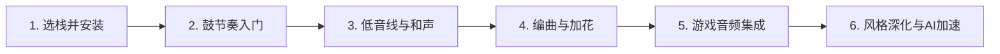

先把结论放前面：
- 如果你**只选一套“主栈”**，我会推荐：  
  **Ableton Live Suite + Vital + Serum + 样本包（Splice 等）+ FMOD Studio**  
  这套组合覆盖：电子舞曲/游戏配乐制作 → DAW 内编曲加花 → 游戏内自适应音频，非常适合你这种有鼓手底子、偏重编曲、又要给游戏做音乐的独立制作人。
- 如果你**预算更敏感 / 想更极客**，可以改成：  
  **REAPER + Vital + 免费合成器/效果器 + FMOD Studio**  
  更轻量、更省钱，但学习曲线略陡、对“自己组装工作流”要求更高。
- 如果你**非常依赖 AI 起步**，可以在上面任意栈里加上：  
  **Suno / Udio 做“灵感生成器” → 分轨导进 DAW 重构/重混**，用 AI 当加速器而不是替代品。
下面我会用“技术栈”的方式，给你 4 套组合，并逐一拆解对比，最后结合你的基础和目标给一条更具体的学习路径。
---
## 一、整体框架：技术栈到底要解决哪些问题？
你的需求可以拆成几块：
1. **音乐制作栈（DAW + 合成器 + 效果器 + 样本）**  
   - 核心工具：DAW（数字音频工作站）
   - 音源：合成器、鼓机、采样器
   - 塑形：EQ、压缩、混响、失真等效果器
   - 素材：样本包、MIDI 包、预设包
2. **风格栈（对应你喜欢的风格）**  
   - New Wave UK Garage、nu-disco、nu-jazz、bass house  
   - 关键词：2-step/碎拍、重低音线、切拍加花、合成器音色设计、侧链压缩等
3. **游戏音频栈（DAW → 游戏引擎）**  
   - 中间件：FMOD / Wwise  
   - 引擎集成：Unity / Unreal  
   - 自适应音乐、交互式音效设计
4. **AI 辅助栈（加速起步，而不是替你做）**  
   - 文本生成音乐：Suno、Udio 等  
   - AI 辅助作曲/编曲：AIVA、Magenta Studio 等  
   - 用法：快速出动机/段落 → 分轨导入 DAW → 大幅改写/重新编曲
---
## 二、4 套技术栈组合对比
### 1. 栈 A：Ableton Live Suite + Vital + Serum + FMOD（推荐）
**适合你什么：**
- 电子音乐（尤其是 UK garage / house / bass 音乐）几乎标配 DAW  
- Session 视图非常适合你这种鼓手出身：  
  先玩 Loop / 打击乐片段，再拖进 Arrangement 编排加花，**即时正反馈非常强**。
- Suite 自带：
  - Wavetable、Operator、Tension 等合成器，做 house / disco 低音线、音效很顺手
  - 丰富的音频效果器，足够你前期不买任何插件也能出活
**核心组件：**
- DAW：**Ableton Live Suite**  
- 合成器：  
  - **Vital**（免费，强烈建议先从它上手）  
  - **Serum**（当你觉得 Vital 不够用时再上，这是目前电子音乐最主流的 wavetable 合成器之一）
- 样本/预设：  
  - Splice / Loopmasters 上的 **UK Garage / Bass House / Nu-disco 样本包**  
  - 专门的 **Serum / Vital 预设包**（house / bass house）
- 游戏音频：**FMOD Studio + Unity/Unreal 集成**
**优点：**
- 电子舞曲/游戏配乐资料最多，教程多、社区大
- Session 视图 + 鼓机 pad，非常适合你“先打节奏再加花”的直觉
- 和 FMOD 的配合很成熟：DAW 分轨导出 → FMOD 做交互/分层
**缺点：**
- Suite 价格不便宜（但可以先用 Intro / Standard 试用）
- 对纯游戏音效设计来说，比 REAPER 稍“重”
---
### 2. 栈 B：FL Studio + Vital + Serum + FMOD
**适合你什么：**
- FL Studio 一直被称为“beatmaker 之王”，**做节奏 + 编曲加花非常顺手**  
- 如果你玩 UK garage / bass house，那种 2-step、切拍节奏在 FL 里做得很顺滑。
**核心组件：**
- DAW：**FL Studio Producer Edition / All Plugins Edition**  
- 合成器：Vital + Serum（同上）  
- 样本/预设：同栈 A  
- 游戏音频：FMOD Studio
**优点：**
- 节奏/加花工作流非常直观，对从鼓手视角切入的人友好
- 自带很多合成器/效果器，性价比不错
- 社区里大量 EDM/UK garage/bass house 教程
**缺点：**
- 录音/混音工作流不如 Ableton/REAPER 直观，后期如果做复杂配乐会稍微折腾
- 游戏音频圈相对更偏 Ableton/REAPER/Wwise/FMOD 一些（但并非硬性限制）
---
### 3. 栈 C：REAPER + Vital + 免费插件群 + FMOD（性价比 / 极客向）
**适合你什么：**
- 预算有限，但愿意花时间自己搭工作流  
- 你是全栈制作人，对“自己配置快捷键/脚本/模板”不排斥
**核心组件：**
- DAW：**REAPER**（便宜、可无限试用，功能完整）
- 合成器：Vital（免费） + 免费合成器/效果器包（如 Surge、Dexed 等，这里不再展开，你可以后续自己补）
- 游戏音频：FMOD Studio（或者 Wwise，但 Wwise 更重，适合大项目）
**优点：**
- 成本极低，REAPER 本身非常便宜
- 高度可定制：脚本、自定义动作、模板，适合你这种“知识系统性强”的人
- 游戏音频圈有不少人在用 REAPER + Wwise/FMOD 做配乐/音效
**缺点：**
- 电子舞曲教程比 Ableton/FL 少，需要更多“自己找路”
- 初始配置要花时间：快捷键、轨道模板、效果器链等
---
### 4. 栈 D：任意 DAW + AI 生成（Suno/Udio）+ FMOD（AI 加速栈）
**适合你什么：**
- 你非常希望**快速听到结果**，依赖即时正反馈  
- 愿意用 AI 当“动机生成器”，而不是完全代工
**核心组件：**
- DAW：建议 Ableton Live / FL Studio / REAPER 任选其一  
- AI 工具：  
  - **Suno**：文本生成整曲，有分轨/导出功能  
  - **Udio**：同样支持生成带分轨的音乐，适合制作人二次加工  
  - **AIVA**：偏电影/游戏配乐风格，适合你做游戏配乐时快速出氛围
- 游戏音频：FMOD Studio
**典型工作流：**
1. 在 Suno/Udio 里用文字提示生成一段 UK garage / nu-disco 片段  
2. 导出分轨（鼓、贝斯、合成器等）  
3. 导入 DAW，**重构结构、重写旋律、替换音色、加花**  
4. 从 DAW 分轨导出到 FMOD，做交互/分层
**优点：**
- 非常适合“旋律编曲新手”：先有完整曲子，再拆解改写，学习曲率大
- 快速出游戏配乐原型，解决“空白画布综合征”
**缺点：**
- 容易陷入“AI 生成 → 小修小补 → 不会自己从零写”的陷阱
- 风格容易偏“AI 味”，需要你主动往目标风格靠
---
## 三、4 套栈的横向对比表
| 维度             | 栈 A：Ableton + Vital + Serum + FMOD | 栈 B：FL Studio + Vital + Serum + FMOD | 栈 C：REAPER + Vital + 免费插件 + FMOD | 栈 D：任意 DAW + AI（Suno/Udio）+ FMOD |
|------------------|--------------------------------------|-----------------------------------------|------------------------------------------|-------------------------------------------|
| 风格契合度       | ★★★★★（电子/舞曲/游戏配乐极主流）   | ★★★★☆（节奏/加花友好，配乐略弱）      | ★★★☆☆（需要自己找教程/模板）          | ★★★☆☆（靠你手动改写）                   |
| 即时正反馈       | ★★★★★（Session 视图 + 鼓机）        | ★★★★☆（钢琴窗+步进音序器）            | ★★★☆☆（需要自建模板）                 | ★★★★★（AI 秒出曲子）                    |
| 学习资料/社区    | ★★★★★（非常多 EDM/游戏配乐教程）    | ★★★★☆（EDM 教程多，配乐略少）         | ★★★☆☆（偏极客/游戏音频圈）            | ★★★★☆（AI 工具文档多，音乐制作需自己补）|
| 游戏配乐适配     | ★★★★★（FMOD/Wwise 生态成熟）        | ★★★★☆（可搭配 FMOD）                  | ★★★★☆（游戏音频圈常用）              | ★★★☆☆（需要你自己实现交互逻辑）        |
| 成本（软件）     | ★★★☆☆（Suite 贵，但可先 Intro）     | ★★★★☆（一次性买断，性价比高）         | ★★★★★（REAPER 便宜/可试用）          | ★★★★☆（AI 工具按量/订阅，可白嫖额度）  |
| 可扩展性/自定义  | ★★★★☆（足够强，但不如 REAPER）      | ★★★☆☆（相对封闭）                     | ★★★★★（脚本/模板高度自由）           | ★★★★☆（AI 工具可 API 集成）            |
**综合推荐：**
- **主栈选栈 A（Ableton Live Suite + Vital + Serum + FMOD）**  
- 如果你非常在意预算，可以退到栈 C（REAPER + Vital + FMOD）。  
- 栈 D 可以作为**附加层**，叠加在任意栈之上，用来加速起步。
---
## 四、结合你个人情况的落地建议
### 1. 先用“鼓手优势”建立节奏框架
你已经打了 6 年架子鼓，这是巨大优势：
- 在 Ableton / FL 中，**先做纯鼓节奏片段**：  
  - 用 Session 视图 / 步进音序器，做 2-step、碎拍、半拍加花  
  - 把你脑海里的节奏型录成 MIDI，不要一开始就上旋律
- 然后再加贝斯线、和声、旋律，**让节奏决定和声与旋律走向**，这对 UK garage / bass house 非常关键。
### 2. 系统补乐理，但只补“最必要的那一点”
你已经学过乐理，只是忘了，建议：
- 重点只补 3 块：  
  1. **节奏与节拍**（对鼓手来说基本是复习，但要把 2-step、三连音、切拍搞清楚）  
  2. **小调音阶 + 和弦级数**（II-V-I 在小调上的用法，对 nu-jazz / nu-disco 很有用）  
  3. **七和弦、九和弦**（让和声不那么“流行歌”）
- 边做边学：  
  - 每次只学 1–2 个概念，立即在 DAW 里写 4 小节动机，而不是啃完整乐理书。
### 3. 先不练人声创作，专注编曲
你人声天赋一般、没词曲基础，完全可以：
- **把自己定位成“编曲/制作人”**，而不是唱作人  
- 人声当成“音色”用：  
  - 用 AI 生成人声旋律（Suno/Udio），再在 DAW 里重写/重录  
  - 或者只做纯器乐：UK garage / bass house 本来就有大量纯器乐曲目。
### 4. 针对 New Wave UK Garage / nu-disco / nu-jazz / bass house 的“风格栈”
这些风格的共性技术点：
- **2-step / 碎拍节奏**：重点在军鼓/踩镲的偏移与加花  
- **重低音线**：Serum / Vital 做低音，注意侧链压缩，让鼓和贝斯不撞车  
- **切拍与加花**：提前 16th / 8th 的军鼓/踩镲，制造推进感  
- **和弦进行**：  
  - nu-disco：借用 70s 放克/迪斯科进行，I-IV-vi-V 之类  
  - nu-jazz：加入 ii-V-I、扩展和弦（9、11、13）  
- **音色选择**：  
  - UK garage：有机感电钢、Rhodes 风格音色 + 有机弦乐  
  - bass house：更脏的低音、失真、副振荡器  
  - nu-disco / nu-jazz：模拟感合成器（Diva、Pigments 等）
---
## 五、一条可执行的学习路径（以栈 A 为例）

### 1. 第 1～2 周：选栈 + 安装 + 基本操作
- 安装：Ableton Live Suite（先用 30 天试用）+ Vital  
- 只做 3 件事：
  1. 学会创建 MIDI/音频轨  
  2. 学会用浏览器拖样本到 Session 视图  
  3. 学会用 Session 录制/循环播放片段
### 2. 第 3～4 周：用鼓手优势，做 10 个节奏动机
- 目标：**只做鼓**，不做旋律  
- 做几种节奏：
  - 2-step UK garage  
  - 半拍 house  
  - 加花碎拍（提前/延后军鼓、踩镲）
- 把你满意的节奏拖进 Arrangement，复制变奏，形成 16–32 小节结构
### 3. 第 5～8 周：加低音线 + 和声
- 用 Vital/Serum 做 1–2 个低音音色：  
  - 简单锯齿波 + 低通滤波 + LFO 调制滤波  
- 和声只先在小调上用：  
  - i – VI – III – VII 之类进行  
- 目标：**完成 3–5 首只有鼓+贝斯+简单和声的 32 小节曲子**
### 4. 第 9～12 周：编曲与加花（重点）
- 学习结构：Intro – A – B – A – Outro / Break – Drop 等  
- 在节奏/和声上做加花：  
  - 军鼓/踩镲提前  
  - 低音节奏微调  
  - 每隔 8 小节做一点小变奏  
- 这阶段你就是在强化“编曲加花”的肌肉记忆。
### 5. 第 13～16 周：游戏音频集成（FMOD）
- 学习 FMOD 基础：事件、分层、参数  
- 从 Ableton 导出分轨，导入 FMOD，做：
  - 简单的战斗/探索分层音乐  
  - 几个音效（脚步、攻击、UI）  
- 在 Unity/Unreal 里调用 FMOD 事件，跑通“游戏触发 → 音乐/音效变化”的闭环。
### 6. 之后：风格深化 + AI 加速
- 针对每种风格做 1–2 首“风格致敬曲”：  
  - UK garage：2-step + 有机感电钢 + 侧链压缩  
  - nu-disco：放克贝斯 + 扩展和弦  
  - nu-jazz：更复杂的和声 + 即兴感旋律  
  - bass house：重低音 + 简化结构 + 强烈 Drop
- 在这个过程中，用 Suno/Udio/AIVA 当“灵感加速器”：  
  - 让 AI 生成 4 小节动机 → 你在 DAW 里扩展成 32 小节  
  - 或者用 AI 生成整曲 → 你拆解、改写、重混，学习它的编曲思路。
---
## 六、最后给你一个简明选择建议
- **如果你愿意投入一点预算，而且希望尽量少折腾工作流**：  
  → 选 **栈 A：Ableton Live Suite + Vital + Serum + FMOD**  
  这会是你作为多媒体艺术家 / 独立游戏制作人的“听觉核心栈”。
- **如果你现在不想花太多钱，但愿意花时间自己搭环境**：  
  → 选 **栈 C：REAPER + Vital + FMOD**，后面有需要再补 Serum / 其他插件。
- **无论选哪个栈，都可以在后期叠加栈 D**：  
  → 用 Suno/Udio 做动机生成，用 AIVA 做游戏配乐原型，然后全部丢进 DAW 重构，这样你既有即时正反馈，又不会失去对音乐的掌控感。
如果你愿意，我可以按你选的那一栈，帮你列一份更细的“前 30 天每日练习菜单”，每天 1–2 小时，专门针对 UK garage / bass house 做动机和加花。
