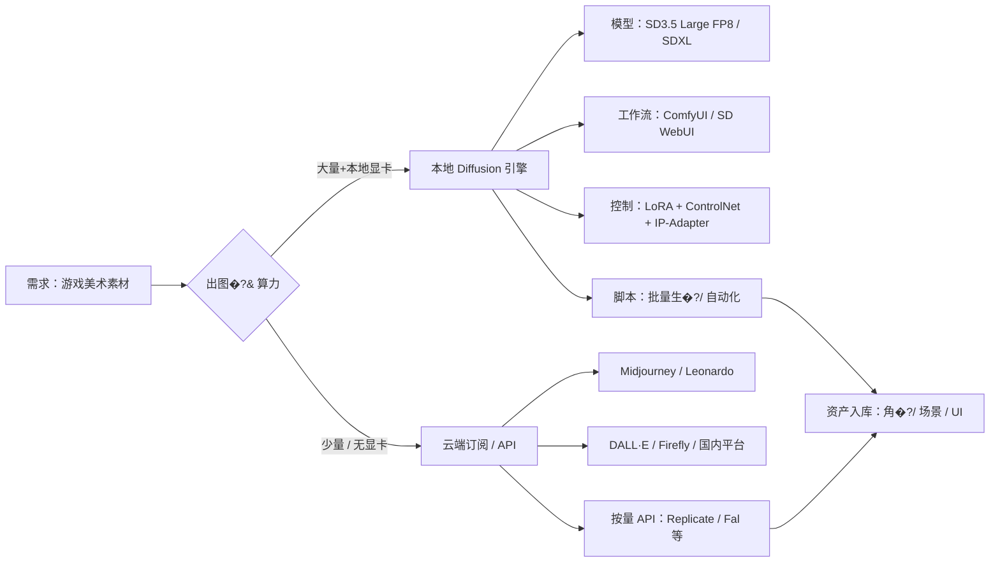
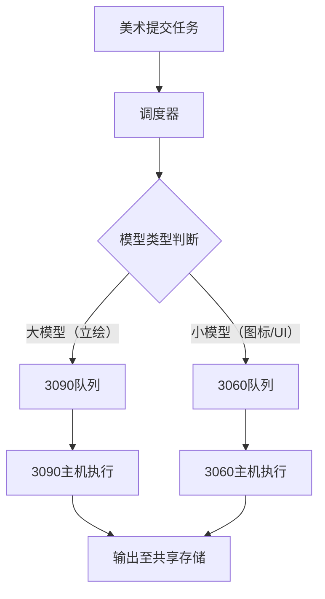

总结�?- 先用订阅试水
- 若进入量产很可能需要本地部署，保证资产安全性和全盘可控性。轻量模型其实对显存要求不高，可用于图标生成
- 集群：本地服务器，集中管理显卡、CPU和存储，有必要筹�?- 模型拆分并行：对于文生图和LLM，在消费级显卡集群技术上不太可行。最好的办法是拆分需求，做异构集�?- 异构集群：推荐大�?060 12G(1500�?，搭载小模型起草和简单美术。少�?090 24G(6000�?，承载大模型、精修�?    - RX 7900 XTX 24GB也值得注意，因为便宜大显存�?    - 昇腾Atlas300i duo�?6G)也值得注意，二�?000不到，算力在3060强因此并发较低，主要因为超大显存，可以跑大参数LLM。但比较折腾�?[[推理集群显卡选型]]
[[本地服务器设计]]

---

先把结论放前面：
- **技术路�?*：作为技术极�?+ 游戏美术，性价比最高的主路线是  
  **“开�?Diffusion 模型 + ComfyUI / SD WebUI + 本地 GPU + 云端 API 补位�?*�? 
  具体模型�?*优先 SD3.5 Large FP8 / SDXL，其�?FLUX.1-dev/schnell**，用 LoRA / ControlNet 做风格和结构控制�?- **订阅 vs 本地**�? 
  - 有中高端显卡（≥8�?2GB VRAM）且大量出图 �?**本地为主，订阅为�?*�? 
  - 显卡弱、偶尔用、或要给非技术美术用 �?**订阅为主（Midjourney / Leonardo / Firefly 等）+ 少量本地**�?下面按技术路线、模型选型、本�?订阅条件逐层拆�?---
## 一、整体技术路线：推荐架构
用一个简化的架构图先整体看一下：

核心思想�?*本地负责量产 + 可控，云端负责灵�?+ 补位**�?---
## 二、模型选型：质�?+ 性价比平�?### 1. 主力模型对比（面向游戏美术）
| 模型 | 画质 & 控制�?| 显存需求（本地推理�?| 适合风格 | 适合场景 | 性价比评�?|
|------|---------------|----------------------|----------|----------|------------|
| **SD3.5 Large / Large Turbo FP8** | 顶级写实 + 动漫，长提示词理解好，手�?结构改善明显 | 原生 FP16 ~18�?9GB；FP8 可压�?~11GB | 写实、角色、场景、UI | 高清概念图、角色立绘、宣传图 | **质量/显存综合最�?*，需 8�?2GB+ �?|
| **SDXL 1.0** | 高画质，写实 + 风格化，生态成�?| 8GB 可跑，更推荐 12GB+ | 插画、角色、UI | 日常概念、大量量�?| **最稳主�?*：教程多、插件多、资源多 |
| **FLUX.1-dev / schnell** | 画质天花板，文字渲染、构图强 | dev 推荐 16�?4GB；FP8 轻量�?6�?2GB | 写实、视觉开发、海�?| 高质量视觉稿、关键帧 | 质量最高，但更吃显存，适合�?24GB 卡时�?|
| **SD1.5** | 老牌，二次元/游戏素材极多 | 4�?GB 可跑 | 二次元、像素、低�?| 快速草图、小体量素材 | 质量偏老，�?*最省资�?*，适合轻量�?|
**建议组合�?*
- �?8�?2GB 显存�? 
  - 主力�?*SD3.5 Large FP8 + SDXL**  
  - 辅助�?*FLUX.1-dev FP8 / schnell**（用 FP8/轻量版压�?6�?2GB�?- 只有 4�?GB 显存�? 
  - 主力�?*SD1.5 + SDXL（低分辨率）**，优先保证跑得动�?### 2. 控制组件：LoRA / ControlNet / IP-Adapter
- **LoRA**：微调风格、角色、道具，几十到几�?MB，是游戏美术**风格统一**的核心�?- **ControlNet**：线稿、深度、姿态控制，�?*角色姿势、场景构�?*特别关键�?- **IP-Adapter**：用参考图控制风格，适合“照着这张图画同角色不同角度”等需求�?对于游戏美术�?*至少要掌�?LoRA + 1�? �?ControlNet**，否则很难做到批量可复用资产�?---
## 三、本地部署：硬件门槛与性价�?### 1. 显存 & 硬件大致门槛
综合 SD3.5 / SDXL / FLUX 的实测与教程�?
| 显存 | 推荐模型 & 精度 | 典型分辨�?| 体验 |
|------|------------------|------------|------|
| 4�?GB | SD1.5；SDXL 低分辨率�?12�?68�?| 512×512 | 能跑，速度偏慢，需频繁�?`--medvram / --lowvram` |
| 6�?GB | SDXL；SD3.5 Medium / FP8 | 768×768�?024×768 | 主流可用，需配合量化与优�?|
| 8�?2GB | **SD3.5 Large FP8 + SDXL** | 1024×1024 | 推荐起步：质量与速度平衡 |
| 12�?6GB | SD3.5 Large FP16；FLUX.1-dev FP8 | 1024×1024�?280×800 | 很舒服，可开更多步数/ControlNet |
| 24GB+ | FLUX.1-dev 原生；SD3.5 Large 原生 | 1024×1024�?048×2048 | 高分辨率量产，专业级 |
**性价比甜点：**
- 新机�?*RTX 4060 8GB / 4060Ti 16GB / 4070 12GB**  
- 二手�?*RTX 3060 12GB / 3070 8GB（注�?VRAM�?*
这些卡在 FP8/优化模式下跑 SD3.5 / SDXL 都比较合适�?### 2. 软件环境：ComfyUI vs SD WebUI
- **ComfyUI**：节点式，适合复杂工作流（ControlNet + LoRA + 多模型组合），极客友好�?- **SD WebUI（Automatic1111 等）**：上手简单，生态成熟，适合美术直接用�?**建议�?*
- 技术极客：**ComfyUI 为主**，做一套可复用的“角�?场景/UI”工作流模板�?- 美术同学�?*SD WebUI + 预设参数**，只管调提示词和种子，不用看节点�?### 3. 本地部署的“隐性成本�?- **电费 + 硬件折旧**：按国内电价，一�?3060/4060 每小时几毛钱，大批量出图比云端便宜很多�?- **运维时间**：装环境、排错、升级模型，初期要预留几小时～几天�?- **版权 & 合规**：开源模型本地生成，**使用条款仍要遵守**（尤其是 SD3.5 / FLUX 的非商业/商业限制）�?---
## 四、订�?/ 云端服务：什么时候更划算�?### 1. 典型订阅服务对比（面向游戏美术）
| 服务 | 价格�?025�?026�?| 画质 & 控制�?| 适合�?| 限制 |
|------|--------------------|----------------|--------|------|
| **Midjourney** | Basic $10/月；Standard $30/月；Pro $60/�?| 顶级美学，艺术感强，控制略弱 | 灵感、概念图、风格探�?| 无本地模型，商业需注意条款 |
| **Leonardo AI** | ~$12/月，8500 tokens（约 150 张） | 多模型，�?SD 生态，控制较好 | 游戏美术、批量草�?| 免费额度有限 |
| **Adobe Firefly** | 单独 ~$10/月，�?CC 全家桶内 | 版权干净，集�?PS/AI | 商业安全、视觉稿 | 风格偏“安全牌”，个性稍�?|
| **DALL·E 4 / ChatGPT Plus** | ChatGPT Plus $20/月，�?DALL·E 图像 | 对话式生图，易上�?| 快速草图、文案配�?| 按张算成本偏高，控制力弱 |
| **国内平台** | 多为几十�?月或按量计费 | 中文提示友好，部分有 SD 底模 | 国内团队、快速出�?| 模型更新 & 稳定度不一 |
**粗略单张成本（云端订阅）�?*
- Midjourney Standard 大量�?Relax 模式时，�?**0.03�?.06 美元/�?*�?- Leonardo / Firefly / 国内平台多在 **0.02�?.10 美元/�?* 区间�?- 本地电费+折旧可压�?**远低�?0.01 美元/�?*（尤其大批量时）�?### 2. 云端 API（按量计费）
- **Replicate / Fal.ai / Hugging Face Inference** 等提�?FLUX / SD3.5 的按�?API�?- 适合�?*少量高质量出�?+ 自动化流水线**，如脚本批量生成概念图�?---
## 五、本�?vs 订阅：按场景给个明确选择
### 1. 个人独立游戏 / 小团�?**典型情况�?*
- 1�? 人，美术兼策�?程序，出图量中～大�?- �?1�? 台带 8�?2GB VRAM 的机器（或愿意升级）�?**推荐�?*
1. **本地部署 SD3.5 Large FP8 + SDXL + LoRA/ControlNet**  
   - �?ComfyUI 做角�?场景/UI 工作流模板�? 
   - 每天几十～几百张图，边际成本几乎只有电费�?2. **补充 Midjourney / Leonardo 订阅**  
   - 用于前期灵感探索、风格寻找；  
   - 确定风格后，用本地模�?+ LoRA 把风格“固化”下来�?**性价比：**  
出图量越大，本地优势越明显；云端只做“灵感启动器”�?### 2. 大中型游戏团�?**典型情况�?*
- 美术团队大，机器配置不统一，很多美术不会折腾本地环境�?- 版权 & 合规要求高，需要稳定的商业授权�?**推荐�?*
1. **统一云端方案：Midjourney / Leonardo / Firefly + 企业许可**  
   - IT 统一订阅，美�?Web 登录即可用，减少运维负担�?2. **内部少量本地 GPU 服务�?*  
   - 部署 SD3.5 / FLUX.1-dev，给概念�?技术美术用，做高质量关键帧 + LoRA 训练�?3. **API 自动化流水线**  
   - �?SD3.5 / FLUX �?API 做批量素材生成（如不同角色换装、换背景）�?**性价比：**  
�?*高重复、可控性强**的活交给本地/API�?*高审美、探索�?*的活交给 Midjourney/Firefly�?### 3. 技术极�?+ 游戏美术的个人组�?**推荐路线�?*
1. **先本�?SD3.5 Large FP8 + ComfyUI**  
   - 硬件：RTX 4060 8GB / 4060Ti 16GB 即可入门�?   - 把“角色设�?+ 场景模板 + UI 模板”做成可复用工作流�?2. **再买一�?Midjourney / Leonardo Basic 订阅**  
   - 专门用来找风格、构图、颜色灵感；  
   - 看中一张图，再回本地用 LoRA + ControlNet 复刻和量产�?3. **�?24GB 卡后，加 FLUX.1-dev 做关键帧**  
   - 海报、关键剧情帧、宣传图，用 FLUX 出高质量，再�?PS 细修�?---
## 六、实际落地建议（按阶段）
1. **阶段 1：验证期�?�? 个月�?*
   - 硬件：先不买卡，用现有电�?+ 云端订阅试水（Midjourney / Leonardo / 国内平台）�?   - 目标：验证“AI 能帮到你哪环节”，建立提示词库和风格库�?2. **阶段 2：量产期�?�?2 个月�?*
   - 硬件：上一�?8�?2GB 卡（推荐 4060 8GB / 4060Ti 16GB）�?   - 软件：本地部�?SD3.5 FP8 + SDXL + ComfyUI，整理角�?场景/UI 工作流�?   - 订阅：保�?Midjourney / Leonardo 做灵感源�?3. **阶段 3：工业化期（1 年后�?*
   - 硬件：视预算升级�?24GB 卡（4070Ti / 4090 等），跑 FLUX.1-dev 原生�?SD3.5 原生�?   - 流程�? 
     - 本地 LoRA 训练 �?自动化批量生�?�?美术精修�? 
     - 云端 API 做定制化流水线（如为每件装备换色、换纹理）�?---
## 七、总结一句话
- **技术路�?*：以 **SD3.5 Large FP8 / SDXL + ComfyUI + LoRA/ControlNet** 为本地主力，**FLUX.1-dev / schnell** 做高质量关键帧，**Midjourney / Leonardo / Firefly** 做灵感与云端补位，是 2026 年对“技术极�?+ 游戏美术”而言在质量、可控性和性价比上最平衡的组合�?- **部署方式**：有中高端显�?�?本地为主；显卡弱 / 团队协作 �?订阅为主，本地为辅�?如果你愿意贴一下自己现在的显卡/预算和主要美术方向（写实 / 二次�?/ 像素 / UI 等），我可以帮你给一份更具体的“模�?+ 参数 + 订阅组合”清单�?

---
---

先把结论放前面：
- **成本控制优先时，显卡集群的核心原则是：先用“显存够用”的卡把业务跑起来，再按真实吞吐瓶颈一点点加卡，不要一上来就上 4090 大集群�?*
- **游戏工作室最务实路线�?*  
  1）先�?**RTX 3060 12GB / 4060 16GB** 做单机试点；  
  2）批量出图时再按需�?**二手 RTX 3090 24GB**�? 
  3）真要大规模投产，再考虑 4090 / 魔改 4080 32GB 这类高端卡�? 
- **集群形态上�?* 优先�?**单机多卡 + �?ComfyUI 实例（任务级并行�?*，而不是一上来就搞复杂的多机分布式。ComfyUI 原生不支持多 GPU 真正模型并行，主流做法是单卡多实例任务分发�?下面按选型、组建、渐进扩展三块讲，始终围绕“性价比”和“成本控制”�?---
## 一、选型：以“显存够�?+ 每元显存”为核心
### 1.1 先定业务需求，再定�?结合你之前问的文生图路线（SD3.5 / SDXL / FLUX），对显存的大致要求�?| 分辨�?/ 任务 | 典型显存需�?| 最低推荐显�?| 说明 |
|---------------|--------------|--------------|------|
| SD1.5 / SDXL 512×512 | 6�?GB | 8GB | 入门 / 大量草图 |
| SDXL 1024×1024（含 ControlNet/LoRA�?| 12�?6GB | 12GB | 游戏美术日常主力 |
| FLUX.1-dev 优化版（1024×1024�?| 18�?4GB | 24GB | 高质量关键帧 |
| 4K 超高�?/ 多模型并�?| >24GB | 32GB+ | 视项目需求再�?|
**关键原则�?*  
- 显存决定“能不能跑”，算力只决定“跑多快”�? 
- 成本控制下，**先满足显存门槛，再追求速度**�?### 1.2 当前�?026）主流卡性价比大致排�?综合二手 / 全新价格与显存、算力：
| 型号 | 显存 | 大致价格区间 | 适用场景 | 性价比评�?|
|------|------|--------------|----------|------------|
| **RTX 3060 12GB** | 12GB GDDR6 | 全新 ~2199 元；二手 1500�?800 �?| SD1.5 / SDXL 512�?68，轻�?ControlNet | **入门性价比之�?*�?2GB 显存�?AI 非常关键 |
| **RTX 4060 16GB** | 16GB GDDR6 | �?2499�?799 �?| SDXL 1024、简�?FLUX FP8 | �?3060 12GB 贵不少，但多 4GB 显存对高分辨率更�?|
| **RTX 3090 24GB（二手）** | 24GB GDDR6X | 5000�?000 �?| SDXL 1024+ / FLUX / 大模型推�?| **24GB 显存性价比最�?*，算力略老但够用 |
| **RTX 4090 24GB** | 24GB GDDR6X | 全新 1.3�?.8 万元 | 高吞�?FLUX / 4K / 训练 | 算力强，�?**每元显存成本�?* |
| **RTX 4080 Super 32GB（魔改）** | 32GB | 8000�?1000 �?| FLUX / 大模型、显存非常吃紧时 | 显存大，算力中等�?*推理性价比不�?*，但噪音和兼容要考虑 |
**从成本控制角度：**
- **起步�?* 3060 12GB / 4060 16GB  
- **扩容�?* 二手 3090 24GB  
- **高端�?* 只在真正需要更高吞�?/ 4K 时才�?4090 / 魔改 4080 32GB
---
## 二、组建：从单机试点到小集群的“最小成本架构�?### 2.1 阶段 0：单机试点（1�? 卡）
**目标：验证业务价值，控制前期投入**
**推荐配置�?*
- 1�? �?**RTX 3060 12GB / 4060 16GB**  
- 主机：中塔机箱，650�?50W 金牌电源，SSD 1TB NVMe  
- 软件：ComfyUI + SD3.5 / SDXL，先�?WebUI 或单实例 ComfyUI 就够
**成本估算（全新）�?*
- 1×3060 12GB 主机 �?4000�?000 �? 
- 2×3060 12GB 主机 �?6500�?000 元（含双卡电源）
**关键�?*
- 先把 **工作流、LoRA、ControlNet 模板** 跑顺，再考虑加卡�? 
- 这一阶段不用考虑多机调度，只做单机多实例任务队列（ComfyUI 自带队列即可）�?---
### 2.2 阶段 1：单机多卡任务级并行�?�? 卡）
**目标：批量出图时提高吞吐，而不是追求单图极限速度**
ComfyUI 原生不支持真正的�?GPU 模型并行，主流做法是�?- **单卡多实例：** 每张 GPU 跑一个独立的 ComfyUI 进程，用 `CUDA_VISIBLE_DEVICES` 绑定不同卡�?- **任务级并行：** 多个任务同时跑在不同 GPU 上，互不干扰�?**典型部署�?×RTX 3090 示例）：**
1. 每张 3090 启动一�?ComfyUI 实例�?```bash
# 实例 0
export CUDA_VISIBLE_DEVICES=0
python main.py --port 8188 --listen
# 实例 1
export CUDA_VISIBLE_DEVICES=1
python main.py --port 8189 --listen
# 实例 2 / 3 同理
```
2. �?Nginx / 简单脚本做轮询，把请求分发�?8188�?191 端口�?**优点�?*
- 配置简单，无需改工作流�? 
- 天然负载均衡（每卡一个队列）�? 
- 某卡崩溃只影响那一个队列，其他继续干活�?**成本估算（二手）�?*
- 4×RTX 3090 24GB �?2�?.8 万元  
- 加上主机 / 电源 / 机箱，总投入约 3�? 万元，就能有 96GB 显存池�?---
### 2.3 阶段 2：多机集群（4�? 卡以上）
**目标：项目并发量上来后，横向扩展到多�?*
**网络与部署：**
- 每台机器 2�? �?3090 / 4090�?*单机仍然用多实例任务级并�?*�?- �?ComfyUI_NetDist 等插件做跨机任务分发�?- �?Nginx / HAProxy 做统一入口，后面挂多台 ComfyUI 服务器�?**关键点：**
- **不要一开始就�?K8s / 复杂调度**，先用简单队�?+ 轮询验证业务模型�?- 跨机通信开销比单机多卡大�?0�?5% 是正常的�?- 成本上，**多机集群的边际收�?*要算清楚：多一台机器，要能多接项目 / 多产出才算值�?---
## 三、渐进扩展：按“真实瓶颈”加卡，而不是按预算
下面用一个渐进流程图概括一下思路�?```mermaid
flowchart LR
  A[阶段0: 单机试点<br/>1-2x3060/4060] --> B{出图�?项目数}
  B -->|少量, 偶尔用| C[维持现状<br/>按需云端补位]
  B -->|批量出图频繁| D[阶段1: 单机多卡<br/>2-4x3090]
  D --> E{GPU 利用�?& 排队情况}
  E -->|GPU 利用率低<br/>排队少| C
  E -->|经常排队<br/>项目积压| F[阶段2: 多机集群<br/>2-4台服务器]
  F --> G{是否�?4K/FLUX<br/>高吞吐需求}
  G -->|主要�?SDXL 1024| H[继续�?3090 集群]
  G -->|大量 FLUX/4K| I[局部升�?4090/4080-32G]
```
### 3.1 第一步：�?3060/4060 把“业务跑顺�?- 只买 **1�? �?3060 12GB / 4060 16GB**，把以下东西固化�?  - 角色立绘、场景、UI 三套标准 ComfyUI 工作流；
  - 项目风格 LoRA + 常用 ControlNet 组合�?  - 提示词模板、参数模板（分辨�?/ 步数 / CFG）�?- 这一步的成本基本就是一台中端游戏主机的钱，但能让你知道�?  - 真正的瓶颈在“出图数量”还是“美术决策”；
  - 哪些资产适合 AI 量产，哪些不适合�?### 3.2 第二步：�?GPU 利用率和排队情况�?3090
**要不要加卡的判断标准�?*
- 监控 `nvidia-smi` �?ComfyUI 队列�?  - 如果 **GPU 利用率长�?>80%**，且任务排队经常 >10�?0 个；
  - 或者项目高峰期，美术要排队等图才能继续工作�?  �?说明 **吞吐是瓶�?*，这时再加卡�?**加什么卡�?*
- 优先�?**二手 RTX 3090 24GB**�?  - 24GB 显存能很好覆�?SDXL 1024 + FLUX 优化版；
  - 二手�?5000�?000 元，�?4090 便宜近一半；
  - 算力略�?4090，但对批量出图场景，**多卡吞吐往往比单卡极致速度更重�?*�?**加卡方式�?*
- 先在同一台机器上�?2 �?�?4 卡（注意电源和散热）�?- 用单机多实例任务级并行，投入产出比最高�?### 3.3 第三步：只在局部用 4090 / 魔改 4080 解决“硬需求�?**什么时候才值得�?4090 / 4080 32GB�?*
- 真正高频使用 FLUX.1-dev 原生�?4K 生成�?090 跑起来太慢或显存紧张�?- 或者要�?LoRA 训练 / 大模型推理，训练时间对项目进度有直接影响�?**成本控制建议�?*
- 不要一次性把所�?3090 换成 4090，而是�?  - **保留 3090 集群做日常量�?*�?  - **单独�?1�? �?4090 服务器做“高质量关键�?/ 训练专用�?*�?- 这样可以用较少的 4090 预算，显著提升关键环节的体验，而不是整体换血�?---
## 四、软成本与运维：别只看显卡价�?### 4.1 电费与折�?- 3090 功�?~350W�?090 ~450W�?- �?0.6�?.8 �?度电估算，一�?3090 满负�?24 小时�?5�? 元；
- 如果不是 7×24 运行，电费其实远没显卡折旧大�?*真正成本是“卡放在那不用�?*�?**建议�?*
- �?**定时开关机 / 自动休眠**，非项目期尽量让 GPU 休息�?- 多机集群可以用云上按�?GPU 做弹性扩容，本地只放基础算力�?### 4.2 运维与人�?- 单机多实例比多机分布式简单很多，**前期不要为了“分布式”而分布式**�?- �?Docker / 镜像统一环境，减少“在我机器上能跑”的问题�?- �?ComfyUI 工作流做版本控制（Git），避免“改坏一个节点全站崩溃”�?---
## 五、一个“性价比优先”的 3 年渐进示�?假设你们�?5�?0 人的游戏工作室，3 年内从试验走向量产：

| 时间 | 目标 | GPU 配置 | 成本区间 | 关键动作 |
|------|------|----------|----------|----------|
| �?0�? �?| 验证 AI 美术价�?| 1�?×RTX 3060 12GB 单机 | 0.4�?.8 �?| 固化工作�?+ LoRA + 出图规范 |
| �?6�?8 �?| 日常量产 + 小规模批�?| 1 �?4×RTX 3090 24GB 单机多实�?| 3�? 万（二手�?| 吞吐不足时再加，优先�?3090 |
| �?18�?6 �?| 多项目并�?+ FLUX/4K 关键�?| 2�? �?4×3090 集群 + 1 �?2×4090 专用 | 8�?2 �?| 日常量产�?3090 集群，高质量/训练�?4090 |
**核心思路�?*
- 前期尽量�?3060/3090 把成本压住；  
- 中期按真实排队情况线性加 3090�? 
- 后期只在局部用 4090 解决特定高价值需求�?---
如果你愿意，可以告诉我：
- 你们现在有几张什么卡�?- 主要�?SDXL 还是 FLUX，分辨率大概多少�?- 预计 1�? 年内项目数量 / 美术人数大致多少�?我可以帮你算一版更具体的“从当前状态到下一阶段”的硬件升级与预算计划�?

---
---

针对你的需求—�?*文生图任务精度优先，且存在图标UI（小模型）和立绘插画（大模型）的分工**，同时考虑成本控制，我提供的方案是�?*一张大显存卡（3090 24GB）为主力，搭配若干小显存卡（3060 12GB）为辅助，通过任务队列组成异构推理集群**。下面给出具体选型、组建和成本分析�?
---

## 一、选型结论：为什么这样组合？

| 卡型 | 价格 | 显存 | 适合任务 | 理由 |
|------|------|------|----------|------|
| **RTX 3090 24GB** | ¥6000 | 24GB | 立绘插画（大模型�?| 能完整运行Flux.1 Pro / SD3.5 Large FP16，输出质量最高，无需模型并行 |
| **RTX 3060 12GB** | ¥1500 | 12GB | 图标UI（小模型�?| 显存足够跑SD1.5/2.1、量化版SDXL、LoRA推理，价格极低，单卡功耗仅170W |

- **为什么不推荐4060 Ti 16GB（�?700）？** 因为16GB对大模型依然不够（完整Flux需22GB+），且价格接�?�?060。对于小模型�?2GB足矣，省下的钱可以多买一�?060，容量翻倍�?- **为什么不推荐用多张小卡做模型并行来跑大模型？** 扩散模型的模型并行需要高速互联（NVLink），且推理延迟大、实现复杂。一�?090直接搞定，成本（¥6000）低�?�?060（�?000�? 额外硬件/运维成本，且效率更高�?
---

## 二、集群组建方案（成本控制型）

### 方案A：单机多卡（适合空间紧凑，需要统一管理�?- **主机**：一台二手工作站或DIY主机（如X99平台 + E5-2680v4 + 64GB内存 + 1200W电源）≈ ¥2000
- **显卡**�?×3090 + 2×3060（总显�?4+12+12=48GB�?- **主板**：需�?个PCIe x16插槽（至少x8通道即可，对推理无影响），如X99双路或Z690/Z790
- **成本**：�?000 + ¥3000 + ¥2000 = **¥11000**
- **软件**：同一台机器上运行多个ComfyUI实例（不同端口），通过本地队列（Redis + Python脚本）分配任务�?- **优势**：管理简单，通信延迟低；功耗约350W+170W+170W�?00W，满负荷月电费约¥300�?- **缺点**：散热需注意�?090发热大），机箱需选择大型全塔，电源要足�?
### 方案B：多台独立主机（推荐，成本更低，更灵活）
- **主机**�?  - **1台主力机**：二手办公主机（i5-10400F + 16GB内存 + 650W电源）≈ ¥1200，插**RTX 3090**�?  - **2台辅助机**：二手办公主机（i5-8400 + 8GB内存 + 450W电源）≈ ¥800/台，每台�?*一块RTX 3060 12GB**�?- **网络**：千兆交换机（�?00�? NAS存放模型/输出（可选，也可用主机本地硬盘）�?- **调度**：一台旧电脑或树莓派（�?00）跑**Redis Queue + 简单调度器**，将任务按模型类型（�?小）分发给对应GPU�?- **成本计算**�?  - 1×3090主力机：¥6000 + ¥1200 = ¥7200
  - 2×3060辅助机：¥1500×2 + ¥800×2 = ¥4600
  - 调度节点：�?00
  - 总计�?*¥12000**（含所有主机、显卡、网络）
- **能力**�?  - 主力机：运行Flux.1 Pro / SD3.5 Large，日产量�?000~5000张高质量图�?  - 辅助机每台：运行SD1.5/SDXL-Turbo/量化模型，日产量各约5000~8000张�?  - 总日产量�?3000~18000张（取决于模型复杂度），且任务自动分流�?- **优势**�?  - 散热容易（每台独立风道），故障隔离（一台坏了不影响其他）�?  - 功耗：0.4kW�?090�? 0.2kW×2�?060�? 主机�?kW，月电费约�?00�?  - 易于扩容：需要更多小卡时，再买一套辅助机即可（�?300/台）�?
---

## 三、调度与工作流设�?


- **任务标签**：在提示词或参数中指�?`model_type: large` �?`model_type: small`，调度器据此路由�?- **队列软件**：推荐使�?**Celery + Redis**（Python生态成熟），或更轻量的 **RQ**�?- **ComfyUI API**：每台GPU主机运行ComfyUI�?`main.py --listen --port 8188`，调度器通过HTTP POST `/prompt` 提交任务�?
---

## 四、成本与性价比对�?
| 方案 | 总硬件成�?| 总显�?| 单张高质量日产量 | 月电�?| 扩展�?|
|------|------------|--------|------------------|--------|--------|
| 单机1×3090+2×3060 | ¥11000 | 48GB | 3000~5000（大�? 10000~16000（小�?| ¥300 | 加卡需大电�?机箱 |
| 多机1×3090+2×3060 | ¥12000 | 48GB | 同上 | ¥400 | **极好**：每台独立加 |
| 全用3090×2 | ¥12000+主机 | 48GB | 6000~10000（大�?| ¥600 | 成本高，无小卡优�?|
| 全用3060×4（模型并行跑大模型） | ¥6000+主机 | 48GB | 低效（通信开销�?| ¥300 | 不可行（质量下降�?|

**结论**�?*多台独立主机方案�?×3090 + 2×3060�?* 性价比最高，兼顾了大模型质量和小模型数量，且扩展灵活，总投入仅¥12000�?
---

## 五、进阶建�?
- **量化模型**：对3090，可以跑Flux.1 Pro FP8（占�?2~14GB），余下显存跑更大batch或同时加载第二个模型（如ControlNet）。这样单卡可同时处理大模�?小模型任务�?- **低功耗模�?*�?060可以通过 `nvidia-smi -lgc 1500,1800` 锁定频率，功耗从170W降至130W，性能仅降10%，适合长期运行�?- **训练任务**�?090可同时承担LoRA训练（需16~20GB显存），3060则专门推理�?
---

## 六、一句话总结

**�?张RTX 3090（�?000）跑立绘/大模型，搭配2张RTX 3060 12GB（�?000）跑图标UI/小模型，通过多台独立主机+Redis队列组建异构集群，总成本约¥12000，获得质量与效率的最优平衡�?*
